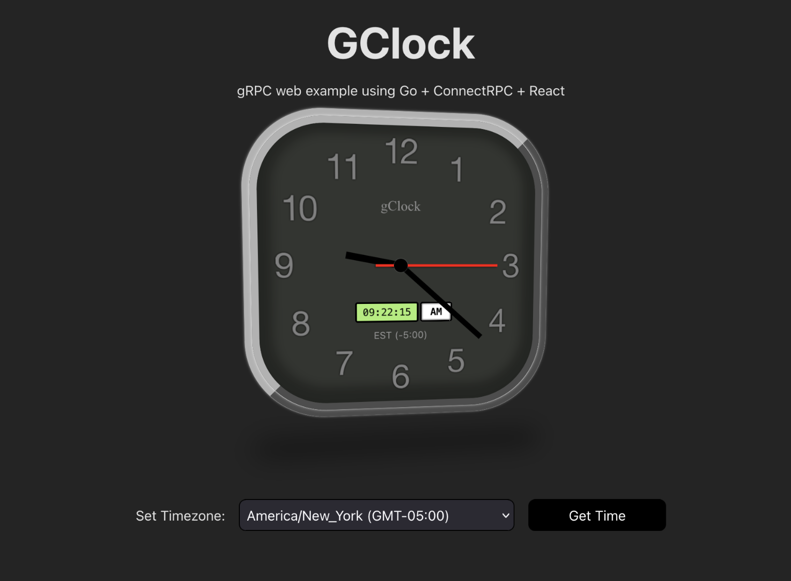

# GClock

GClock is an example application using ConnectRPC, Go and React




## Setup

```
cd frontend;  npm install
```


### start backend
```sh
cd backend
go run cmd/main.go run
```

### start frontend
```sh
cd frontend
npm run dev
```
